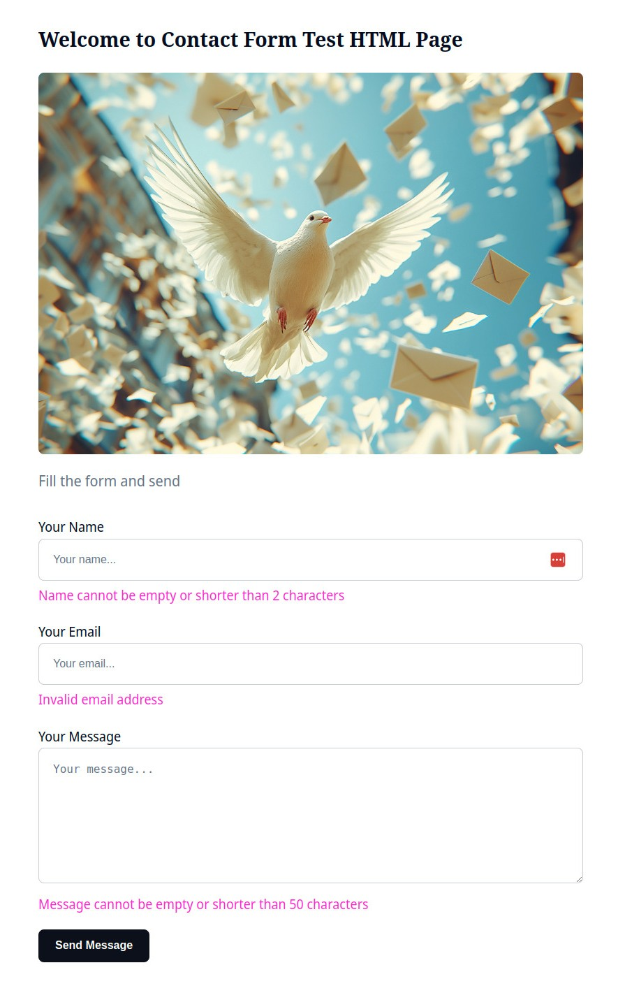

# Contact Form PHP Server

This is a simple Contact Form PHP server component designed to send emails.

This project was inspired by the need to create a simple contact form for a static website.

The contact form code is written in PHP for easy deployment to the most popular
and widely used cPanel hosting where PHP is supported.

It needs at least PHP 5.5 version.

* [Features](#features)
* [Deployment](#deployment)
* [Configuration & Security](#configuration--security)
* [Sample Form Code](#sample-htmlcssjs-form-code)
* [Credits](#credits)

## Features

* Simple PHP code for sending emails based on PHPMailer
* Easy to deploy to a cPanel hosting
* Easy to configure

## Deployment

The contact form php code uses [PHPMailer](https://github.com/PHPMailer/PHPMailer) please download its source 
and put it in a folder `./phpmailer` when deployed to your server.

The `contact_send.php` looks for the phpmailer at the same level:
```bash
./phpmailer/PHPMailer.php
./phpmailer/Exception.php
./phpmailer/SMTP.php
./phpmailer/...

./config.php
./contact_send.php
```

## Configuration & Security

You can check the config file in [`./src/config.php`](./src/config.php) for details.

I recommend setting up a separate Gmail account for the contact form 
instead of using your main email account.

Additionally, you should generate an app password for the contact form:
https://myaccount.google.com/apppasswords

The app password should be set in the `CONTACT_FORM_SMTP_PASSWORD` 
in the [`./src/config.php`](./src/config.php). 

Using an app password is not recommended from a security point of view, 
which is why we create a separate Gmail account.

Use the same email for both `CONTACT_FORM_SMTP_USERNAME` and `CONTACT_FORM_TO_EMAIL` 
to keep it simple and ensure all messages from this contact form are safely received 
in this dedicated Gmail account.

## Sample Form Code

Check the [`./test/...`](./test) for a sample HTML/CSS/JS code for the contact form usage,
style and validation.

You must set your HTTP server URLs in the [`./test/contact-form.html`](./test/contact-form.html).

There is validation in [`./test/contact-form-validation.js`](./test/contact-form-validation.js) for name, email, and message.

The validation set for the name is at least two symbols, and for the message, 
it is at least 50 symbols.

</img>

## Credits

* The main hard of the code is using https://github.com/PHPMailer/PHPMailer
* The CSS spinner code is from https://css-loaders.com/spinner/
* Some parts of the CSS are from Jekyll theme https://jekyllthemes.io/theme/mria-multipurpose-jekyll-theme

If you are not a developer, do not want to host your own server, or need spam protection, 
I recommend using the paid service [Formspree](https://formspree.io/), which also offers a free tier.
